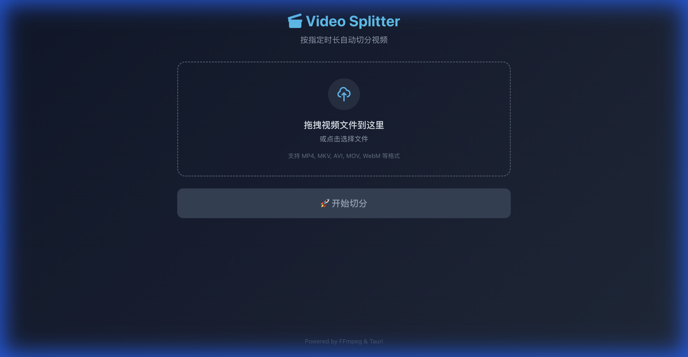

# 🎬 Video Clipping 视频切片工具

高效的视频切片工具，基于 Tauri + React 构建的跨平台桌面应用。



---

## ✨ 功能特点

- 🎯 **按时长切分** - 将长视频按指定时长自动切分成多个片段
- ⚡ **无损切分** - 使用 FFmpeg 流复制，无需重新编码，速度极快
- 🖱️ **拖拽上传** - 支持拖拽视频文件或点击选择
- ⏱️ **灵活设置** - 秒/分钟单位切换，预设快捷按钮
- 📊 **实时进度** - 显示切分进度和当前处理片段
- 🎥 **视频预览** - 源视频和切分结果均支持播放预览
- 📂 **一键打开** - 快速打开输出文件夹
- 🌙 **主题切换** - 支持 Light/Dark 主题切换

---

## 🎥 支持格式

| 输入格式 | 输出格式 |
|---------|---------|
| MP4, MKV, AVI, MOV, WebM, FLV, WMV, M4V | 与输入格式相同 |

---

## 📦 系统要求

### 运行要求
- **macOS** 10.15+ (Catalina 或更高版本)
- **FFmpeg** 已安装（用于视频处理）

### 开发要求
- Node.js 18+
- Rust 1.70+
- FFmpeg 4.0+

---

## 🚀 快速开始

### 方式一：下载预编译版本

1. 从 [Releases](https://github.com/yourname/video-clipping/releases) 下载最新的 `.dmg` 文件
2. 打开 DMG，将 `Video Clipping.app` 拖入 Applications 文件夹
3. 首次运行可能需要在「系统偏好设置 > 安全性与隐私」中允许运行

### 方式二：从源码构建

```bash
# 克隆仓库
git clone https://github.com/yourname/video-clipping.git
cd video-clipping

# 安装依赖
npm install

# 开发模式运行
npm run tauri dev

# 构建生产版本
npm run tauri build
```

---

## 📖 使用教程

### 1️⃣ 选择视频文件

- **方式 A**：直接将视频文件拖拽到虚线框内
- **方式 B**：点击虚线框区域，在文件选择器中选择视频

选择后会自动识别视频时长并显示文件名。

### 2️⃣ 预览视频（可选）

选择视频后，点击「预览视频」按钮可以播放预览：
- ▶️ 播放/暂停
- 进度条拖拽跳转
- 🔊 音量调节

### 3️⃣ 设置切分时长

- 在输入框中输入每段视频的目标时长
- 点击「秒」或「分钟」切换单位
- 或使用快捷按钮选择预设时长：
  - 30秒 | 1分钟 | 5分钟 | 10分钟 | 30分钟

底部会显示预计切分的片段数量。

### 4️⃣ 选择输出目录

- 默认输出到源视频所在目录
- 点击「选择...」按钮可更改输出位置

### 5️⃣ 开始切分

点击 **「🚀 开始切分」** 按钮开始处理。

- 处理过程中会显示进度条
- 显示当前正在处理的片段编号
- 处理完成后显示所有输出文件列表

### 6️⃣ 查看结果

- 切分完成后，输出文件以 `原文件名_000.mp4`、`原文件名_001.mp4` 格式命名
- 点击任意输出文件可预览播放
- 点击「打开文件夹」可直接跳转到输出目录

---

## 🌙 主题切换

点击右上角的 🌙/☀️ 图标可在深色/浅色主题之间切换：
- 自动保存主题偏好
- 首次使用时自动检测系统主题

---

## ⚙️ 高级配置

### FFmpeg 安装

#### macOS (使用 Homebrew)
```bash
brew install ffmpeg
```

#### 验证安装
```bash
ffmpeg -version
ffprobe -version
```

### 环境变量

如果 FFmpeg 不在系统 PATH 中，可以设置环境变量：

```bash
export PATH="/path/to/ffmpeg/bin:$PATH"
```

---

## 🛠️ 开发指南

### 项目结构

```
video-clipping/
├── src/                    # React 前端源码
│   ├── components/         # UI 组件
│   │   ├── FileDropZone.tsx    # 文件拖拽上传
│   │   ├── DurationInput.tsx   # 时长设置
│   │   ├── OutputSelector.tsx  # 输出目录选择
│   │   ├── ProgressBar.tsx     # 进度显示
│   │   ├── ResultList.tsx      # 结果列表
│   │   ├── VideoPlayer.tsx     # 视频播放器
│   │   └── ThemeToggle.tsx     # 主题切换
│   ├── contexts/           # React Context
│   │   └── ThemeContext.tsx    # 主题状态管理
│   ├── hooks/              # React Hooks
│   │   └── useVideoSplit.ts    # 视频切分逻辑
│   ├── App.tsx             # 主应用
│   └── index.css           # 样式文件
├── src-tauri/              # Rust 后端源码
│   └── src/
│       ├── lib.rs          # Tauri 入口
│       ├── commands.rs     # 命令处理
│       └── ffmpeg.rs       # FFmpeg 封装
├── package.json
└── tailwind.config.js
```

### 常用命令

```bash
# 安装依赖
npm install

# 开发模式（热重载）
npm run tauri dev

# 构建生产版本
npm run tauri build

# 仅构建前端
npm run build

# 代码检查
npm run lint
```

### 技术栈

| 层级 | 技术 |
|------|------|
| 前端框架 | React 18 + TypeScript |
| 构建工具 | Vite 5 |
| 样式方案 | Tailwind CSS 3 |
| 桌面框架 | Tauri 2.0 |
| 后端语言 | Rust |
| 视频处理 | FFmpeg |

---

## ❓ 常见问题

### Q: 切分速度如何？
**A:** 由于使用流复制（无需重新编码），切分速度非常快，通常每秒可处理 GB 级别的数据。

### Q: 切分会损失画质吗？
**A:** 不会。本工具使用 FFmpeg 的 `-c copy` 参数，直接复制视频流，不进行任何重新编码。

### Q: 为什么切分点不是精确的时间？
**A:** FFmpeg 在无损模式下会在最近的关键帧处进行切分，以保证视频可以正常播放。

### Q: 视频预览没有画面怎么办？
**A:** 请确保重启应用后再试。如果仍有问题，可能是视频编码格式不被浏览器支持。

### Q: 支持批量处理吗？
**A:** 当前版本暂不支持批量处理，该功能正在开发中。

### Q: 可以在 Windows 上运行吗？
**A:** 代码架构支持跨平台，但当前仅在 macOS 上测试。Windows 版本即将推出。

---

## 📝 更新日志

### v0.1.0 (2024-12-24)
- 🎉 首次发布
- ✨ 基础视频切分功能
- ✨ 拖拽上传支持
- ✨ 实时进度显示
- ✨ 视频预览播放
- ✨ Light/Dark 主题切换
- ✨ 现代化深色 UI

---

## 📄 开源协议

本项目基于 [MIT License](LICENSE) 开源。

---

## 🤝 贡献

欢迎提交 Issue 和 Pull Request！

1. Fork 本仓库
2. 创建功能分支 (`git checkout -b feature/amazing-feature`)
3. 提交更改 (`git commit -m 'Add amazing feature'`)
4. 推送到分支 (`git push origin feature/amazing-feature`)
5. 提交 Pull Request

---

## 📧 联系方式

如有问题或建议，请通过以下方式联系：

- 提交 [GitHub Issue](https://github.com/yourname/video-clipping/issues)
- 发送邮件至 your-email@example.com

---

<p align="center">
  Made with ❤️ using Tauri + React + Rust
</p>
